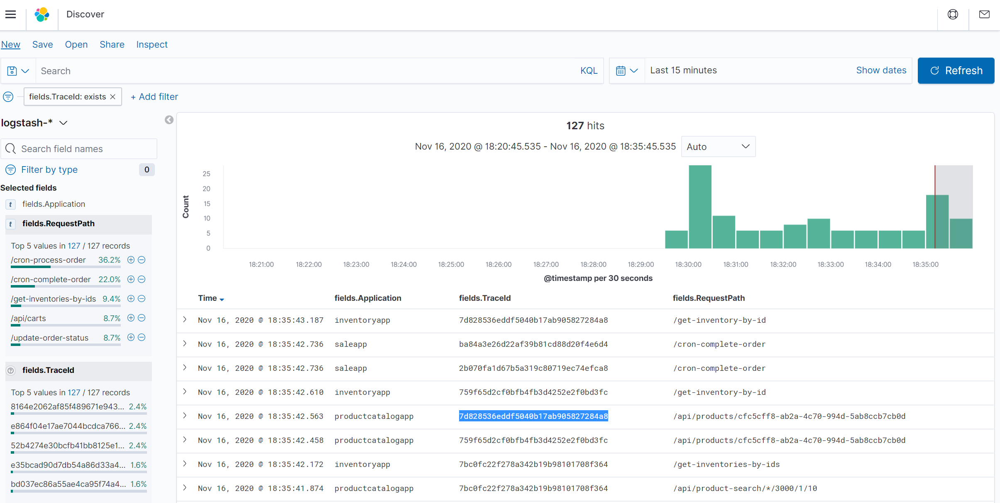

# Sdks & Toolings

> [dotnet](dot.net) --version 5.0.100

> [dapr](https://github.com/dapr/dapr) --version CLI version: 1.0.0-rc.2 Runtime version: 0.11.3

> [osm](https://github.com/openservicemesh/osm) version Version: v0.3.0; Commit: c91c782; Date: 2020-08-12-21:49

> [tye](https://github.com/dotnet/tye) --version 0.5.0-alpha.20520.1+739de2eeb94f0246f50fa4993e953abb4b0da18a

# Only wanna see it run => coolstore apps via tye

```
$ tye run
```

Go to `http://localhost:8000` => have fun

# Wanna go deep inside => run dapr cli with hardcore mode

## Init core component:

Enabled `vm.max_map_count` for ElasticSearch

```
$ sysctl -w vm.max_map_count=262144
```

### 1. `docker-compose` option

```
$ docker-compose -f docker-compose.yml -f docker-compose.override.yml down --remove-orphans -v
$ docker-compose -f docker-compose.yml -f docker-compose.override.yml up postgresql zipkin redis elasticsearch
```

### 2. `tye` option

```
$ tye run tye.slim.yaml
```

## Run dapr apps locally via dapr cli

```
$ dapr run --app-port 5001 --app-id identityapp dotnet run -- -p src\Services\Identity\IdentityService\IdentityService.csproj
```

```
$ dapr run --app-port 5002 --app-id inventoryapp dotnet run -- -p src\Services\Inventory\InventoryService.Api\InventoryService.Api.csproj
```

```
$ dapr run --app-port 5003 --app-id productcatalogapp dotnet run -- -p src\Services\ProductCatalog\ProductCatalogService.Api\ProductCatalogService.Api.csproj
```

```
$ dapr run --app-port 5004 --app-id shoppingcartapp dotnet run -- -p src\Services\ShoppingCart\ShoppingCartService.Api\ShoppingCartService.Api.csproj
```

## Tracing issues

- Setup Kibana with `TraceId`, `HandlerName`, `RequestPath`, `level` and filter with `HandlerName`



Then, you can find the exception happend in code via Kibana dashboard with settings above. Grab the `TraceId`, then paste it to `Zipkin` dashboard, then you can see the tracing of this request as the following picture

